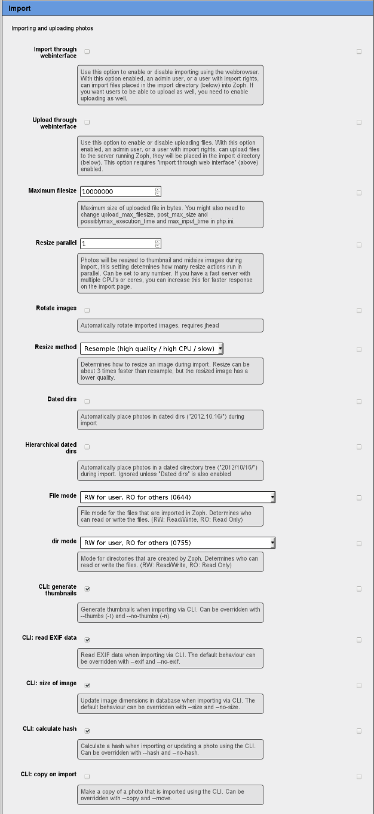

# Import using the CLI #
Many users will use the Zoph webinterface almost exclusively to work with Zoph. However, more advanced users may prefer the commandline interface (CLI) for some tasks. Zoph has a CLI client called `zoph` that can be used to import photos and make (bulk) changes to photos already in the database.

A detailed overview of all the options can be found in [The Zoph CLI tool](CLI.md).

## configuration ##
### zoph.ini ###
First of all, you will need a valid [zoph.ini](CONFIGURATION.md#contents-of-zophini) file to work with the CLI client. If you have multiple Zoph installations on your system, an important difference with the webinterface is the fact that the CLI cannot automatically determine which Zoph installation (instance) you are trying to import photos to. By default it will take the first instance, otherwise you need to specify the [--instance](CLI.md#--instance) CLI option. See the [CONFIGURATION](CONFIGURATION.md) documentation for some examples.

### Webinterface ###

There are several option related to import in the configuration page (under admin). See the screenshot for an overview. The options should be self-explanatory.

## Specifying which photos to import ##
Of course you want to tell Zoph which photos it should import. The list of photos is **always** specified **last**. You can simply specify filenames, but you can also use your shell's "globbing" feature to specify multiple photos at once.
### example ###
Let's say you have a bunch of photos plus a text file in a directory:

````
zoph@zoph $ ls
IMG_1203.JPG     IMG_1207.JPG     IMG_1211.JPG     IMG_1215.JPG     IMG_1219.JPG
IMG_1204.JPG     IMG_1208.JPG     IMG_1212.JPG     IMG_1216.JPG     IMG_1220.JPG
IMG_1205.JPG     IMG_1209.JPG     IMG_1213.JPG     IMG_1217.JPG     IMG_1221.JPG
IMG_1206.JPG     IMG_1210.JPG     IMG_1214.JPG     IMG_1218.JPG     photos.txt
````
If you want to import all photos, you could do
````
zoph@zoph $ zoph *
````
However, this will cause an error when zoph tries to import a textfile, so it's better to do:
````
zoph@zoph $ zoph *.JPG
````
Or even
````
zoph@zoph $ zoph IMG_12*.JPG
````
But, what if you would like to import only some of these photos, for example, 1203 to 1205, 1210 to 1219 (except 1213), 1220 and 1221. You could of course specify every file individually:
````
zoph@zoph $ zoph IMG_1203.JPG IMG_1204.JPG IMG_1205.JPG IMG_1210.JPG IMG_1211.JPG IMG_1212.JPG IMG_1214.JPG
              IMG_1215.JPG IMG_1216.JPG IMG_1217.JPG IMG_1218.JPG IMG_1219.JPG IMG_1220.JPG IMG_1221.JPG
````
Well, I don't know about you, but *I* certainly didn't buy a computer to do things by myself, so why not let the computer take care of that?
````
zoph@zoph $ zoph IMG_120[3-5].JPG  IMG_121[^3]*.JPG IMG_122*.JPG
````
That saved a lot of typing, didn't it? This is not a zoph feature, by the way, it is a feature of your shell (probably [Bash](http://www.gnu.org/software/bash/bash.html)). 

## Organizing photos ##
You could just import your photos like described above and then use the Zoph webinterface to organize them, but why not organize them right away? 
### Albums, categories and people ###
You can put your photo in one or more albums and one or more categories (well, that's actually zero or more, since you don't *have* to put them in an album or category). Use the [--album](CLI.md#--album) and [--category](CLI.md#--category) commandline option for this. If there are any people on the photo, you can add people to the photo using the [--person](CLI.md#--person) option. Remember that the list of photos *always* comes *after* the other options. It's important to realize that the album, category or person must already be in the database. 

#### Examples ####
Import `IMG_1300.JPG` and place it in the album **Summer** and category **Landscapes**:
````
zoph@zoph $ zoph --album "Summer" --category "Landscapes" IMG_1300.JPG
````

Import `john.jpg` and place it in the album **Family**, category **Portraits** and specify **John Doe** is in this picture:
````
zoph@zoph $ zoph --album "Family" --category "Portraits" --person "John Doe" john.jpg
````
Import `family.jpg` and place it in the albums **Family** and **Summer** and specify **John Doe**, **Johnny Doe** and **Jane Doe** are in this picture:
````
zoph@zoph $ zoph --album "Family" --album "Summer" --category "Portraits" --person "John Doe, Johnny Doe, Jane Doe" family.jpg
````
Import `guitarists.jpg` and place it in the categories **Music** and **Musicians** and specify **Hank Marvin**, **Jimi Hendrix** and **Brian May** are in this picture:
````
zoph@zoph $ zoph --category "Music, Musicians" --person "Hank Marvin" --person "Jimi Hendrix" --person "Brian May" guitarists.jpg
````
As you can see, you can add multiple albums, categories or people by repeating the [--album](CLI.md#--album), [--category](CLI.md#--category) or [--person](CLI.md#--person) option multiple times, or by specifying it only once and give it a list of albums, categories or people, separated by commas.

### Photographer and location ###
Of course, you also want to record *where* and *by whom* the your photos were taken. This works almost the same als albums, categories and people, *except* that you can only store *one of each*. Again, the person and place must be in the database prior to using it via the CLI. Specify the photographer using the [--photographer](CLI.md#--photographer) option and the location using the [--location](CLI.md#--location) option.

#### Examples ####
Import `IMG_1400.JPG` and set **John Doe** as the photographer:
````
zoph@zoph $ zoph --photographer "John Doe" IMG_1400.JPG
````

Import `IMG_1401.JPG` and set **Berlin** as the location where the photo was taken:
````
zoph@zoph $ zoph --location "Berlin" IMG_1401.JPG
````

### Other fields ###
There are a lot more attributes Zoph can store about your photos. Many of them will be automatically read from the photo's EXIF information. You can also set these fields manually using the [--field](CLI.md#--field) option.
#### Examples ####
Import `IMG_1416.JPG` and set the title:
````
zoph@zoph $ zoph --field "Title=A nice photo" IMG_1416.JPG
````

## Import directory ##
During the import, Zoph moves (or copies) your photos to a directory that you have set to be the `image_dir`. You set this in the configuration screen. Under this directory, Zoph can create subdirectories. This is controlled by the [--path](CLI.md#--path), [--dateddirs](CLI.md#--dateddirs) and [--hierarchical](CLI.md#--hierarchical) options.

With [--path](CLI.md#--path), you can manually set a path that will be inserted between the `image_dir` and the filename. With [--dateddirs](CLI.md#--dateddirs) and [--hierarchical](CLI.md#--hierarchical), Zoph will create directories based on the (EXIF-)date of the photo. If you specify both a pathname and [--dateddirs](CLI.md#--dateddirs) or [--hierarchical](CLI.md#--hierarchical), the location will contain the path first and the dated directory second.

### Examples ###
Assume IMG_1480.JPG was taken on 5 May 2010 and IMG_1481.JPG was taken on 13 May 2010 and image_dir is set to `/data/photos`.
````
zoph@zoph $ zoph IMG_1480.JPG IMG_1481.JPG
zoph@zoph $ ls /data/photos
  mid
  thumb
  IMG_1480.JPG
  IMG_1481.JPG
````
Ok, now let's add a `--path`:
````
zoph@zoph $ zoph --path "family" IMG_1480.JPG IMG_1481.JPG
zoph@zoph $ ls /data/photos
  family

zoph@zoph $ ls /data/photos/family
  mid
  thumb
  IMG_1480.JPG
  IMG_1481.JPG
````
And `--dateddirs`:
````
zoph@zoph $ zoph --dateddirs IMG_1480.JPG IMG_1481.JPG
zoph@zoph $ ls /data/photos
  2010.05.05
  2010.05.13
zoph@zoph $ ls /data/photos/2010.05.05
  mid
  thumb
  IMG_1480.JPG
````
This is of course nice if you only have a few photos, but when your collection grows and you have taken photos spread over several years, you will end up with hundreds of dated directories. For this reason, there is hierarchical dated directories:
````
zoph@zoph $ zoph --hierarchical IMG_1480.JPG IMG_1481.JPG
zoph@zoph $ ls /data/photos
  2010
zoph@zoph $ ls /data/photos/2010
  05
zoph@zoph $ ls /data/photos/2010/05
  05
  13
zoph@zoph $ ls /data/photos/2010/05/05
  mid
  thumb
  IMG_1480.JPG
````
You could, of course, also use both a path and dated directories:
````
zoph@zoph $ zoph --path "family" --hierarchical IMG_1480.JPG
zoph@zoph $ zoph --path "family" --dateddirs IMG_1481.JPG
zoph@zoph $ ls /data/photos
  family
zoph@zoph $ ls /data/photos/family
  2010
  2010.05.13
````
Although mixing `--dateddirs` and `--hierarchical` is probably not a good idea if you want to keep your collection organized and also, at least somewhat accessible directly from the OS (as opposed to from Zoph).
(By the way, when specifying both `--dateddirs` *and* `--hierarchical`, hierarchical will take precedence).

## Using dirpattern ##
With the [--dirpattern](CLI.md#--dirpattern) CLI option, you can automatically assign albums, categories, people, photographer, location or path based on the directories the photos are in. You do this by specifying a pattern, based on which Zoph will use directory names to assign to correct organizer. This pattern consists of a list of letters, where each letter is a directory. The letters you can use are: **a** (album), **c** (category), **l** (location), **p** (person), **P** (photographer) and **D** (path).

Let's say you have the following directory structure:
````
 |- John Doe
 |   |- Walk in the park
 |   |   |- Trees
 |   |   |   |- IMG_2001.JPG
 |   |   |   |- IMG_2002.JPG
 |   |   |   |- Flowers
 |   |   |        |- IMG_2003.JPG
 |   |   |- Flowers
 |   |       |- IMG_2004.JPG
 |   |- A day in the forest
 |   |   |- Trees
 |   |   |   |- IMG_2005.JPG
 |   |   |   |- IMG_2006.JPG
 |   |   |   |- Birds
 |   |   |       |- IMG_2007.JPG
 |   |   |- Animals
 |   |       |- IMG_2008.JPG
 |   |- Summer Holiday
 |       |- IMG_2009.JPG
 |       |- IMG_2010.JPG
 |- Jane Doe
     |- A day in the forest
     |   |- Trees
     |   |   |- DSC_1000.JPG
     |   |   |- DSC_1001.JPG
     |   |   |- Birds
     |   |       |- DSC_1002.JPG
     |   |- Animals
     |       |- DSC_1003.JPG
     |- Summer Holiday
         |- DSC_1004.JPG
         |- DSC_1005.JPG
````
Now, you can go into the top directory and run a Zoph import with the `--dirpattern` option, to automatically assign a photographer, an album and a few categories to each photo:
````
zoph --import -r --dirpattern "Pacc" *
````
Zoph will now import the entire directory structure, using the first level directory name to assign the photographer (the **P** in the dirpattern), the second level to assign an album (**a**) and the third and fourth to assign categories (**cc**). 
In this example, `IMG_2001.JPG` to `IMG_2010.JPG` will be stored with "John Doe" as photographer and the photos `DSC_1000.JPG` to `DSC_1005.JPG` will be stored with "Jane Doe" as photographer. 
`IMG_2001.JPG` to `IMG_2004.JPG` will have album "A walk in the park".

`IMG_2005.JPG` to `IMG_2008.JPG` as well as `DSC_1000.JPG` to `IMG_1003.JPG` will be in the album "A day in the forest".

`IMG_2009.JPG`, `IMG_2010.JPG`, `DSC_1004.JPG` and `DSC_1005.JPG` will be in the album "Summer Holiday".

`IMG_2001.JPG`, `IMG_2002.JPG`, `IMG_2003.JPG`, `IMG_2005.JPG` to `IMG_2007.JPG` and `DSC_1000.JPG` to `IMG_1002.JPG` will be in the category Trees.

`IMG_2003.JPG` and `IMG_2004.JPG` will be in the category Flowers. Which means that `IMG_2003.JPG` will be assigned to *both* Trees and Flowers. In the same way, `DSC_1002.JPG` will be assigned to both Trees and Birds.

`IMG_2008.JPG` and `DSC_1003.JPG` will be in the category Animals.

Finally, the photos in the "Summer Holiday" album, will not have any categories assigned.

## Controlling the way `zoph` works ##
The Zoph CLI client has several options that control how it works, an example of `--dateddirs` and `--hierarchical` has been given above. More settings can be found in [The Zoph CLI tool](CLI.md).

