# Importing photos - through the web interface #
A photo album is of little use without photos. This page describes how to import photos into Zoph with the webinterface. You could also use the [Zoph/Using the commandline tools](CLI.md). 

The import process in Zoph consists of 2 steps: **uploading** and **importing**. If you have access to the filesystem of the server, you can skip the uploading and manually move the files you wish to import into the directory specified as `upload dir` on the [configuration screen](CONFIGURATION.md).  You can then use the webinterface to import them into Zoph. If you don't have access to the server's filesystem or do not wish to use it, you can upload photos to the `upload dir` and then use the same process. You can even mix the two: copy some photos directly into the `upload dir` and upload others and then continue as if it is one set of photos (which it actually is now).

## Configuration ##
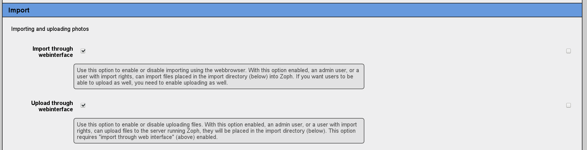
There are several configuration options that are related to importing and uploading photos.
At least, make sure `Import through webinterface` is enabled and if you also want to enable uploading photos through the webinterface, also enable `Upload through webinterface`. Furthermore, make sure that the `upload dir` under `paths` is set correctly. On some systems it might be needed to set the `magic file` in order for Zoph to be able to figure out the filetypes of the imported photos.

## Uploading ##
To import photos in Zoph, first click on "Import" in the main menu. If you do not have that option, your useraccount is not permitted to perform imports or importing is disabled. Once you have clicked on the option, you will be taken to the Import page.

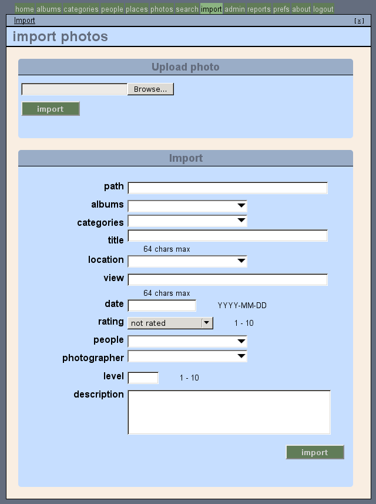

Next, click on "Browse..." to select an image on your local disk. Due to browser/operating system restrictions, you can only select one image at a time. Once you have selected an image, click "Import" to start the upload. Your browser will now upload the photo to the webserver that is running your Zoph installation and place it in the upload directory you have specified in the configuration.

Once you have clicked "Import", Zoph will display a progress bar indicating how the import is progressing. At the same time, it will create a new upload form, enabling you to start another upload. There is no limit on the number of uploads you can do simultaneously (although of course each additional upload will slow down all the other uploads and use resources on both the uploading system and the server running Zoph).

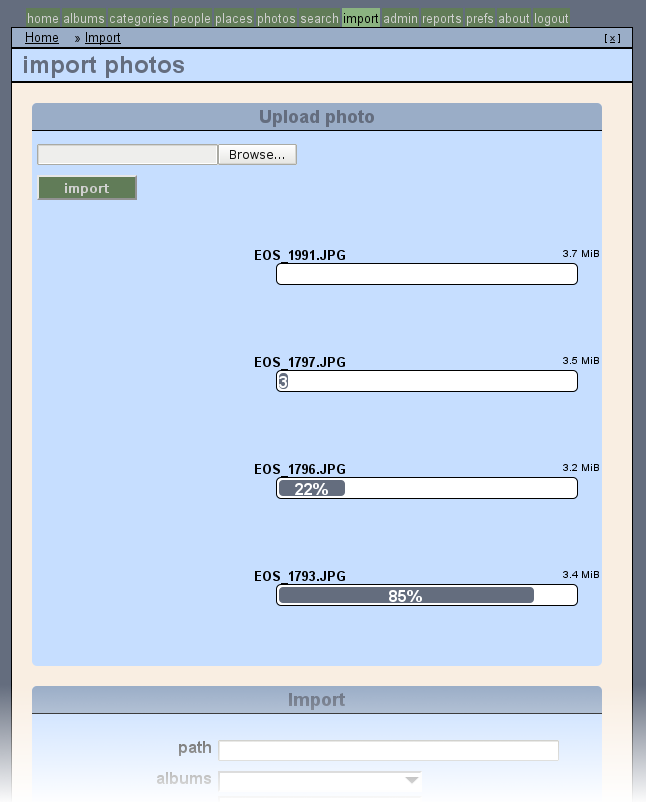

As soon as the first upload is finished, Zoph will create a new 'window' on the page, "Uploaded Photos" and will place the newly uploaded photo in this window. At first, the photo will be displayed using an icon, but at the same time, Zoph will create a thumbnail for this image. Each additional finished upload will be placed in this window and thumbnails will be created. Zoph will show you with an icon which image is being resized and which images are waiting. By default, Zoph will resize one image at a time. You can use the `resize parallel` setting (on the configuration page) to enable multiple parallel resize jobs.

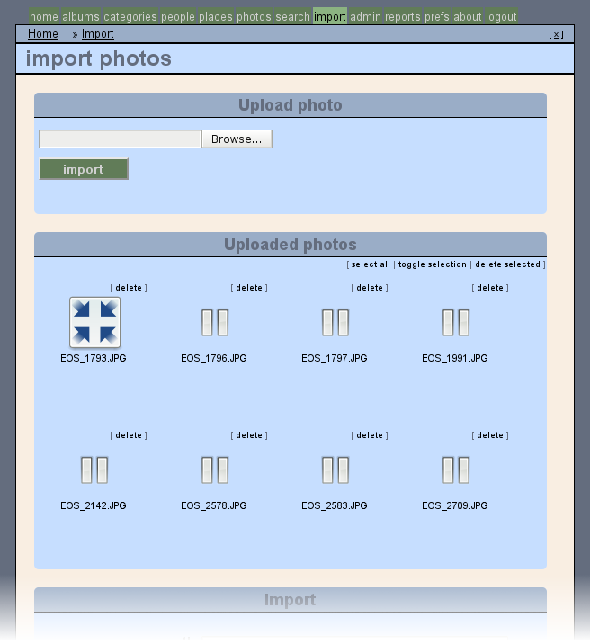

Once the thumbnail is created, the icon will be replaced by a thumbnail image. If you hold your mouse still over the thumbnail, you will see a "midsize" image, which will enable you to take a closer look to the photos.

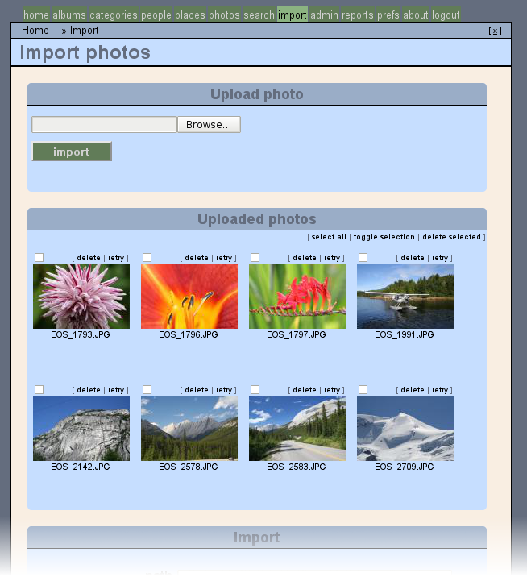

## Setting properties of photos ##
So, now the photos are on the server, we can import them into Zoph. We could just hit the "Import" button at the bottom of the screen and add the photos to albums, categories, etc. later, but it's probably easier to do it now. Keep in mind that all categories, albums, etc. will have to exist before you can use them on the import screen, it is (currently) not possible to add them from the import screen. Once all uploads have finished, it is no problem to leave the import page and go create albums, categories, etc. The photos are all stored on the server, so when you return to the import page, the photos will still be there.

### Album ###
The photos I have just uploaded were all taken during a summer vacation in Canada, so I have created an album "Canada" under the "Summer vacation" album. To assign this album to imported photos, I click on the white box next to "albums" to display a dropdown menu that shows all the albums I have created. When I click on "Canada", the white box will display "Canada" and a new, empty field is created in case I want to add more.

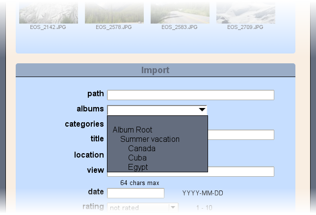 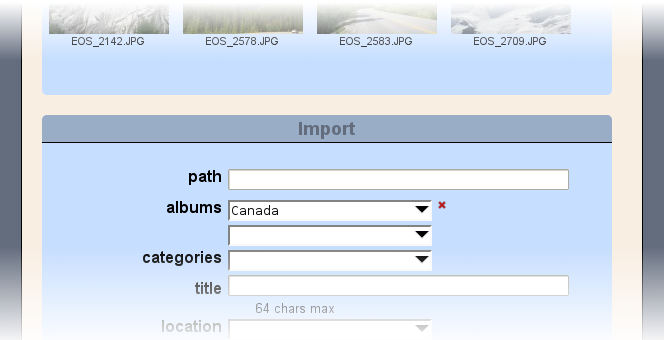

### Photographer and Location ###
All photos are taken by me, so I'm adding myself as the photographer and all photos were taken in Canada, so I set the location to "Canada" (In a real-world situation, you'd probably want to be a bit more precise about the location where your photos were taken, but for this example this will do). Note that, since a photo can only have one location and one photographer, no empty field is added.

### Categories ###
Now, I would like to add categories. I use categories to describe what is on the photo. But, in this case, there are many different subjects on these photos, how are we going to do that? Let's start with flowers. First, I select the category "flowers" and then I 'tick' each photo with flowers.

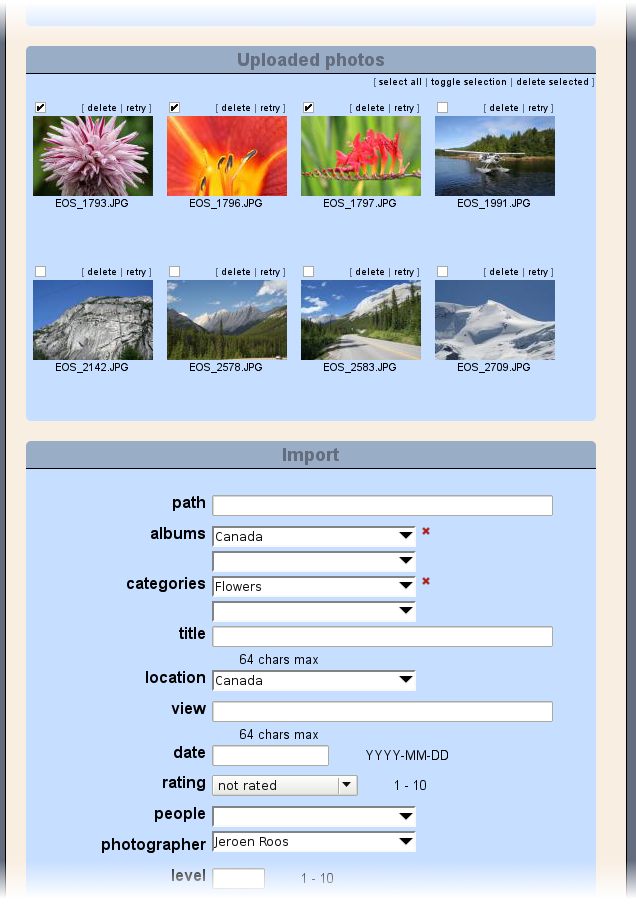

## Importing ##
Finally, click "Import" and Zoph starts importing the photos into the database. Have a moment of patience and the 3 selected photos will disappear from the "Uploaded photos" window because they are no longer in the "upload" directory. At the same time a "details" window is added, showing you any messages the import process generated. If something goes wrong, the error message will also be displayed. In that case, the photos will not disappear from the "Uploaded photos" window, so you can easily try again after you have resolved the problem.

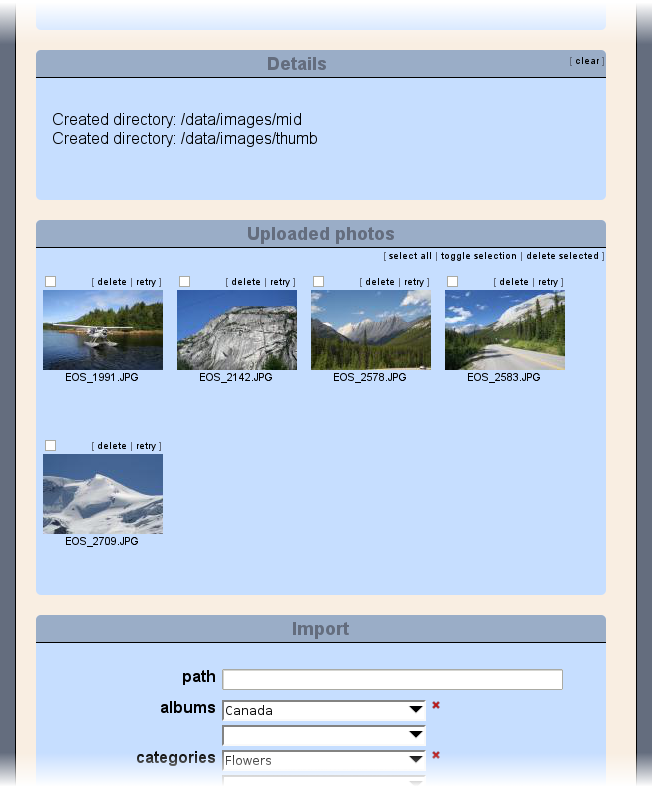

### Using autocomplete ###
So, let's import a few more photos. As you can see, the album, category, location and photographer we have chosen before, are still there, so we only need to change the category. The next picture shows a plane and no flowers at all, so click the little red "x" next to "Flowers" to remove that category and then click the empty field next to categories. The list of categories is quite long, so why search the list yourself, if you can let the computer do that for you? We are looking for a category named "planes", so we'll type a "p", the list will now be significantly shorter, only showing categories starting with "p". We select "planes" by clicking on it. Finally, we'll tick the photo we want to import and then hit "Import" to start the import.

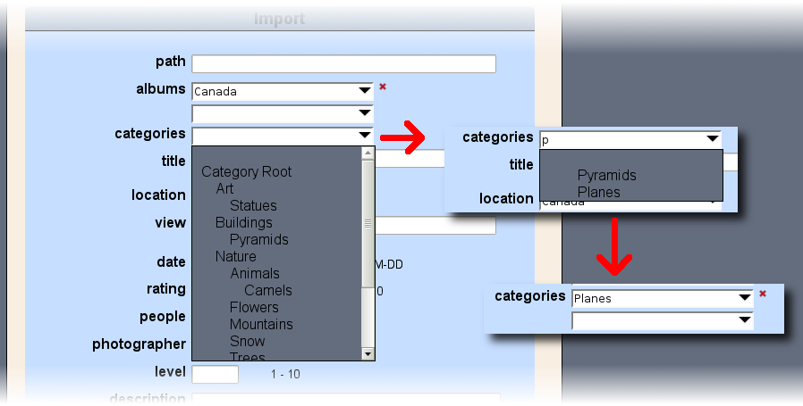

### Multiple categories ###
Now we only have 4 photos left. They all feature 'mountains', so let's remove the category "Planes" and add "Mountains". The first two mostly feature mountains while the others also feature other subjects. We'll just tick the first two, click import, and wait for the photo's to be imported. This time, we don't click the little red "x" next to "Mountains", but instead, add a second category. "Roads", for the first one. Again, we tick the photo we want to import, click "Import" and wait for the photo to be imported. 
The last photo features "Mountains" and "Snow", so, we want to remove "Roads" and add "Snow". Instead of using the red "x", you can also simply re-open the dropdown box and choose "Snow" (or type "snow" or a part of that). Tick the last photo and wait for the "Uploaded photos" window to disappear, since all photos have now been imported.

## Uploading an archive ##
Uploading photos one-by-one can take a lot of time. Even worse, once you're uploading 5 or 10 photos simultaneously, your browser could get a bit slow. Wouldn't it be great if you could upload a bunch of photos in one go? Well, you can! Just put them in a ZIP or TAR archive and upload that!

For this exercise, I have put a few of my photos from a vacation on Cuba in a zipfile called cuba.zip. First, I am uploading the file to the server. Just click on "Browse...", find the ZIP-file on my local disk and then "Import".

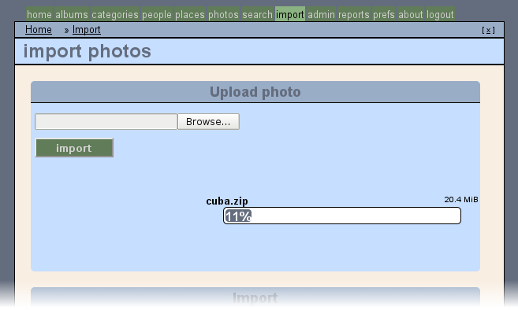

### Correcting problems ###
Depending on the speed of the connection to the server, the upload may take a long time, since ZIPing a photo usually doesn't make it any smaller. We use the ZIP file only to be able to upload multiple files in one go. Once the upload is finished, it will appear in the "Uploaded photos" window:

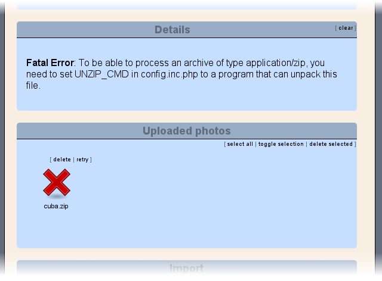

Oops! Something went wrong there! I forgot to configure `unzip command` on the configuration screen. After I have changed that (in a separate browser window), I simply click on "retry" to give it another go. I don't need to re-upload the file.

As you can see, Zoph now starts unpacking the archive (notice the 'unpack' icon). The error from the previous action is still there, that could be confusing; fortunately you can remove it by clicking "clear" in the "Details" window.

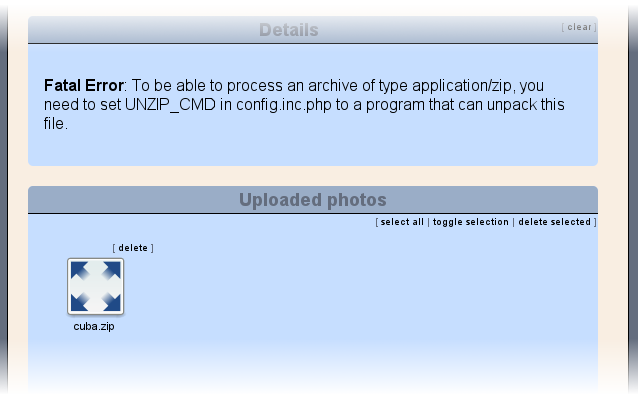

After Zoph has finished decompressing the ZIP file, the photos in it will appear in the same way as if they were uploaded one-by-one. If Zoph encounters another archive inside the archive, it will unpack it as well. If you upload a .tar.gz file, this is exactly what happens: Zoph un-gzips it, resulting in a .tar file, which will be unTARred. Of course, you must have defined `ungzip command` and `untar command` in the configuration screen for this to work. Besides ZIP, TAR and GZ, Zoph supports BZIP files as well. Define `unbzip command` to enable that. (But remember, it makes little sense to Gzip or Bzip a bunch of photos, it will not make the file any smaller!)

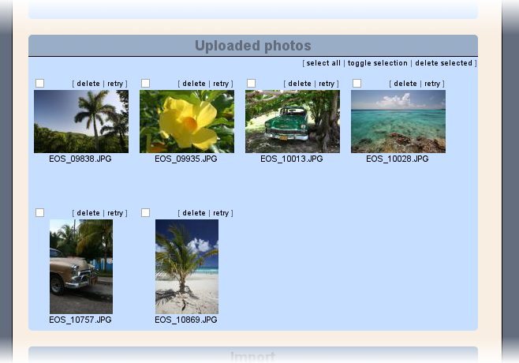

## Importing local files ##
In many cases, the server running Zoph, may be the same machine that you are working on, or it may be sitting next to that machine. In those cases, uploading photos via the webinterface may be an unnecessary inconvenience. In that case, you may simple move or copy the files into the upload directory and then visit the webinterface. Zoph will find the photos and start resizing them. After that, you can proceed with importing just like the two previous cases. 
