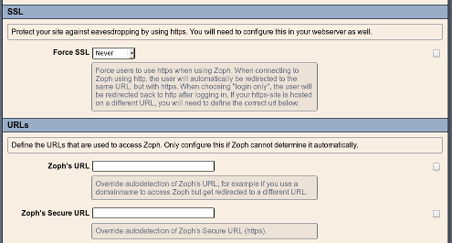

# UPGRADE INSTRUCTIONS #
## Zoph 0.9.6 or 0.9.7 to 0.9.8 ##

* *If you want to upgrade from an older version, first follow the instructions to upgrade to 0.9.6. It is not necessary to install older versions first, you can just install the current version and follow the upgrade instructions below.*

### Copy files ###
Copy the contents of the `php` directory, including all subdirs, into your webroot. 
```
    cp -a php/* /var/www/html/zoph
```
If you use the CLI client, you should copy it to a path that's in your `$PATH`
```
    cp cli/zoph /usr/bin
```

### Database changes ###
* There are no database changes in v0.9.7 and v0.9.8

### Deprecated configuration ###
I will be removing the `ssl.force`, `url.http` and `url.https` configuration option in v0.9.9. As of v0.9.8, Zoph will show a warning. If your setup requires setting these functions, please comment on [issue#100](http://github.com/jeroenrnl/zoph/issues/100)



## Zoph 0.9.5 to 0.9.6 ##
* *If you want to upgrade from an older version, first follow the instructions to upgrade to 0.9.5. It is not necessary to install older versions first, you can just install the current version and follow the upgrade instructions below.*

### Copy files ###
Copy the contents of the `php` directory, including all subdirs, into your webroot.
```
    cp -a php/* /var/www/html/zoph
```
If you use the CLI client, you should copy it to a path that's in your `$PATH`
```
    cp cli/zoph /usr/bin
```
### Database changes ###
Execute zoph-update-0.9.6.sql:
```
     mysql -u zoph_admin -p zoph < sql/zoph_update-0.9.6.sql
```
Changes this script makes:

* Give several timestamp fields a default value, because as of MySQL 5.7.4 "0000-00-00 00:00:00" is no longer a valid date in the default configuration (this was reverted in MySQL 5.7.8)
* Set `person_id` in the `zoph_users` table to have a default of `NULL` instead of `"0"`
* Drop the `column contact_type` from `zoph_places`, as it was not used as of Zoph 0.3.3 (!)

## Zoph 0.9.4 to 0.9.5 ##
* *If you want to upgrade from an older version, first follow the instructions to upgrade to 0.9.4. It is not necessary to install older versions first, you can just install the current version and follow the upgrade instructions below.*

### Copy files ###
Copy the contents of the `php` directory, including all subdirs, into your webroot.
```
    cp -a php/* /var/www/html/zoph
```
If you use the CLI client, you should copy it to a path that's in your `$PATH`
```
    cp cli/zoph /usr/bin
```
### Database changes ###
There are no database changes for 0.9.5

## Zoph 0.9.3 to 0.9.4 ##
* *If you want to upgrade from an older version, first follow the instructions to upgrade to 0.9.3. It is not necessary to install older versions first, you can just install the current version and follow the upgrade instructions below.*

### Copy files ###
Copy the contents of the `php` directory, including all subdirs, into your webroot.
```
    cp -a php/* /var/www/html/zoph
```

### Database changes ###
* Execute zoph-update-0.9.4.sql:
```
    mysql -u zoph_admin -p zoph < sql/zoph_update-0.9.4.sql
```
Changes this script makes:

* Add a field that stores whether or not new subalbums should be automatically granted permission
* Add new colour schemes

## Zoph 0.9.2 to 0.9.3 ##
* If you want to upgrade from an older version, first follow the instructions to upgrade to 0.9.2. It is not necessary to install older versions first, you can just install the current version and follow the upgrade instructions below.

### Copy files ###

Copy the contents of the php directory, including all subdirs, into your webroot.
```
    cp -a php/* /var/www/html/zoph
```
## Database changes ##
* Execute zoph-update-0.9.3.sql:
```
    mysql -u zoph_admin -p zoph < sql/zoph_update-0.9.3.sql
```
Changes this script makes:

* Resize the `password` field to allow store bigger hashes
* Add fields to the `user` table to allow for new access rights
* Add `created_by` fields to the albums, categories, places, people and circles tables

## Zoph 0.9.1 to 0.9.2 ##
* *If you want to upgrade from an older version, first follow the instructions to upgrade to 0.9.1. It is not necessary to install older versions first, you can just install the current version and follow the upgrade instructions below.*

### Copy files ###
Copy the contents of the `php` directory, including all subdirs, into your webroot. 
```
     cp -a php/* /var/www/html/zoph
```
### Database changes ###
* Execute zoph-update-0.9.2.sql:
```
    mysql -u zoph_admin -p zoph < sql/zoph_update-0.9.2.sql
```
Changes this script makes:

* Add previously missing 'random' sortorder to preferences
* Resize Last IP address field so IPv6 addresses can be stored
* Database changes for 'circles' feature
* Create a VIEW on the database to speed up queries for non-admin users
