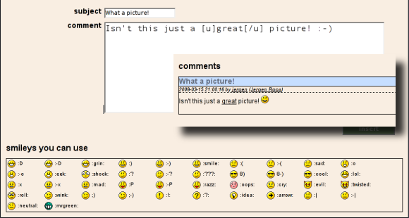

# Using the Web Interface #
This manual will describe how to start using Zoph. It assumes you have successfully installed all the components and are presented the logon screen when you visit http://localhost/zoph/logon.php (if you are not running your web browser on the same machine as where you are running Zoph, you will need to replace `localhost` with the hostname or IP address of that machine.

## Logging In For The First Time ##
An admin user was created when you loaded the database. You should be able to login as `admin` using the password `admin`. You will be presented with Zoph's home page where you will be greeted as 'Unknown Person'. There will be a blank square where a random photo would normally appear.

The first thing you should do is change the admin's password:

1. Click on the 'prefs' tab.
2. Click the 'change password' link.
3. Enter a new password and click 'submit'.

Next, create a 'person' record for yourself:

4. Click on the 'people' tab.
5. Click on the [ new ] link on the right.
6. Fill in your first name, last name and whatever other fields you wish.
7. Click the 'Insert' button.

Now create a user for yourself:

8. Click on the 'admin' tab.
9. Click on the 'users' icon.
10. Click on [ new ].
11. Pick a username and password.
12. Select yourself from the person pulldown.
13. Change your class to Admin.
14. Click the 'Insert' button.

An admin has permission to do anything so you don't need to grant the specific 'browse' or 'view details' permissions, nor grant permissions to individual albums.

Now that you have created a user:

15. Click on the 'logout' tab.
16. Login as your user.

## Creating An Album, Category and Place ##

Before importing some images we'll create an album to put them in. Note that you do not need to assign photos to an album if you don't want to.

To create an album:

1. Click on the 'albums' tab.
2. Click on [ new ].
3. Pick an album name. I'm using "Zoph Tutorial" for this example.
4. Add an album description if you wish. This can be left blank.
5. Click the 'Insert' button.

To create a category, click on the 'category' tab and do exactly as above.

To create a place:

6. Click on the 'places' tab.
7. Click on [ new ].
8. Enter a title at minimum.
9. Click the 'Insert' button.

Albums, categories and places are hierarchical in nature (each entry can have children entries as well). When you view photos in an album, category or place within Zoph you can choose whether you see just the photo in that album, category or place or also automatically see photos placed in their children.

Once you are creating more albums, categories and places, you can change the hierarchy by choosing the 'parent' album, category or place.

## Importing photos ##

Once you have your Zoph installation up and running, the next step is to add photos to it. There are 3 ways to import photos in Zoph:

1. Uploading and importing them using the webinterface
2. Placing the photos in the upload directory and importing them using the webinterface
3. Importing the photos using the Command Line Interface (CLI) tool.

The first 2 are described in [Using the webinterface to import photos](IMPORT-WEB.md), the last one is described in [using the CLI](CLI.md).

## Viewing Photos ##

Now that there are some photos in the database, I'll go over some features of the web interface. The UI is fairly self-explanatory so you probably don't really have to read this section.

### Finding Photos ###

There are numerous ways to find the photos you just entered, a few of which are:

- Browse to the album you created and click [ view photos ].
- Browse to yourself in 'people' and click [ photos by ].
- Browse to the place you took of photo and click [ photos at ].
- Use the search form. Specifying no criteria will bring up all photos.
- Use the 'photos' tab and you can browse every photo in Zoph.

### The Results Page ###

By default the results page will show thumbnails of up to 12 photos (you can change this from the 'prefs' page). On the prefs page you can also choose whether or not to display descriptions under the thumbnails.

From this page you can:

- Click on a thumbnail to go to the photo page.
- Click on [ Prev ] or [ Next ], or use the pager, to page through the photos (if your results span more than one page).
- Click on [ Slideshow ] to enter slideshow mode.
- Reorder the photos by choosing a field from the pulldown.
- Change the direction of ordering by clicking on one of the triangles. The white triangle/arrow represents the current direction.
- Change the number of rows and columns displayed.

### The Photo Page ###
Once you click on a thumbnail, you will go to a page for that photo. Here you'll see a mid sized version of the photo plus all the information about the photo available.

From this page you can:

- Click the name of the file or the image itself to bring up the full sized photo.
- Click on a person, place, album, category or date to take you to the corresponding pages.
- Click on [ Prev ] or [ Next ] to move through the photos as they appeared on the results page.
- Click on [ email ] to email the photo (If this function is enabled in the configuration).
- Click on [ lightbox ] to add the photo to your [lightbox](#lightboxes) (if you have one)
- Click on [ edit ] or [ delete ]. (if you are an admin or have been given write permission on the album in which the photo appears).

If you set the auto edit pref, you will automatically be presented with fields to edit the info about a photo whenever you click on a thumbnail. Clicking [ return ] takes you back to the regular view.

### Slideshows ###

The slideshow mode (entered from the results page) will cycle through the current set of photos by refreshing the browser window. The interval between refreshes can be set on the 'prefs' page.

From the slideshow page you can:

- Click on [ pause ] to pause the slideshow.
- Click on [ stop ] to return to the results page.
- Click on [ open ] to view the current photo on the normal photo page.

### The Search Page ###

You can search for photos using multiple criteria on the search page. Note that when you select an album or category, all descendant albums or categories will also automatically be chosen.

By default all criteria are joined by "and". You can choose "or" instead from the pulldowns in the left most column. Since you can not specify groupings of the conditions, you might not get the results you want if you try to construct complex queries using different conjunctions.

Note that for non-admin users, the album, category, location, person and photographer menus are pruned so that only those entries that actually appear in a photo that the user has access to are shown.

### Random Photos ###

The thumbnail that appears on the 'home' page is randomly selected. I tend to like this photo to be somewhat good so I created a setting on the 'prefs' page that lets you specify the minimum rating to be used when selecting a random photo.

If you want to create a never ending slideshow of random photos, you can do this by clicking the "randomly chosen photo" link on the home page. If you then click the [ Slideshow ] link on the results page a new random photo will be chosen for each slide.

### Lightboxes ###

Lightboxes give someone a place to gather and share their favorite photos. In Zoph, lightboxes are simply albums. When editing a user, an admin can declare a certain album to be the lightbox for that user. The admin must grant the user permission to view the lightbox album as well.

IMPORTANT: Don't give a user write permission on their lightbox album. The user could then add any photo to their lightbox and be able to edit it.

Whenever the user views a photo they can click a 'lightbox' link which will add that photo to their lightbox. When a user is viewing their lightbox, each photo will have an 'x' below it. Clicking this will remove that photo from the lightbox.

Lightboxes allow users to gather photos of interest to them without requiring the ability to edit a photo to place it in an album.

Lightboxes are only activated for a user by specifying a lightbox album. The setup I used was to create a "Lightbox" album, under which I created separate albums for each user's lightbox (e.g. "Jason's Lightbox").

To share a lightbox an admin must grant permission to that album to other users.

## Managing Users, Groups & Restricting Access ##

One of the features of Zoph is its system of access privileges. You have already created an admin class user for yourself. If you desire, you can create other users as well.

### Users ###
Creating a new user account

1. Log on with an admin account.
2. Click "admin" in the menubar.
3. Click "users".
4. Click "new" in the right top of the screen.
5. Specify a user name (e.g. first initial + last name).
6. If the user is also represented by a "person" in your database (for example because he or she has taken photos or appears on them), specify a person, otherwise leave it on "Unknown Person".
7. Specify a password
8. Select a user class: an Admin can do anything. A User has restrictions. In that case, you can specify what a user can see, besides photos:
- **browse people**: the user can view the 'people' page in which all the people stored in the database can be seen.
- **browse places**: the user can view the 'places' page in which all the places stored in the database can be seen.
- **details of people**: if "Yes" the user can see all information about any person. If "No" the user will only see a person's name.
- **details of places**: if "Yes" the user can see all information about any place. If "No" the user will only see a place's title and city.
- **import**: if "Yes" the user can import photos
- **download zipfiles**: if "Yes", this user can download a set of photos (album, category, search result, etc.) as a zip file.
- **leave comments**: if "Yes", this user can leave comments with photos.
- **rate photos**: if "Yes", this user can rate photos.
- **rate photos multiple times**: if "Yes", this user can rate the same photo more than once. Use this if you create an account that is used by multiple people. Each photo can be rated once per IP address.
        lightbox: the user's lightbox album
9. Click "insert"
10. Add the user to one or more groups. See [groups](#groups) how to do that.

### Modifying or deleting a user account ###

1. Log on with an admin account.
2. Click "admin" in the menubar.
3. Click "users".
4. Click the user you want to modify
5. Click "edit" or "delete"
6. Make the desired changes or confirm in case of a deletion.
For a description of the fields, see creating a new user account.

### Groups ###
In order to give users access to photos, you must create one or more groups, you can then give accessrights to albums to those groups, you could for example create a group 'family', a group 'colleagues' and a group 'friends'. A user can be member of multiple groups and Zoph will combine the accessrights for all the groups.

#### Creating a group ####
1. Log on with an admin account.
2. Click "admin" in the menubar.
3. Click "groups".
4. Enter a group name
5. If desired, enter a description.
6. Click "insert"
You will automatically be taken to the edit group screen. See [Modifying a group](#modifying-a-group) for an explanation.

#### Modifying a group ####
1. Log on with an admin account.
2. Click "admin" in the menubar.
3. Click "groups".
4. Click on "display" next to the group name you wish to edit
5. Click on "edit"
6. You can change the group name or description and add or remove a member. 
  - If you modify the group name, all the members will automatically change to the new group.
  - Select a user from the list to add them to the group
  - To remove a member from the group, tick the box in front of the username
7. Click "update".
  - This screen has two "update" buttons, be sure to click the top one for these modifications.
8. To add albums to the list this user can view, use the "grant access to all existing albums" or add a specific album. For a more detailed explanation, see [albums](#albums).
9. Click "update".
  - This screen has two "update" buttons, be sure to click the bottom one for these modifications.  Be sure to modify either the top or the bottom half of this screen and not both.

### Albums ###

For non-Admin users, permissions to view photos are granted on a per album basis. For each album you grant a group access to, you must specify:

- An access level
- A Watermark level (if you have enabled watermarking in the configuration)
- Whether that album will be writable

Zoph determines whether a user has access to a photo checking two things:
1. Is this photo in an album that at least one of the groups the user is member of has access to?
2. If so, is the group's access level for that album greater than or equal to the level of the photo?

If both of these conditions are met, the user has access to the photo.

If you have enabled watermarking, a photo with an watermark level lower than the photo's level, will see full-sized photos with a watermark on them.

If a photo appears in more than one album, a user needs only to have permission on one of them to see the photo. If the user has access to multiple albums in which a photo is found, or the user has multiple groups that give access to the photo, the least restrictive (highest access level) permission is used.

The level of a photo (and therefore of access levels) can range from 0 to 10. The default access level is 5.

Zoph is designed so that these privileges should work transparently. It should appear to any user that they have access to all photos. There should be no reference to any album or photo (including photo counts) to which a user does not have access.

If an album is marked writable, members of the group may edit the photos that they have access to in that album.

If you want to grant a group access to all albums you can do this all at once and the access level and writable flag will apply to every album. This is handy if you want to let someone see everything but don't want them to change anything.

Note that when you create new albums you will have to grant permissions to any non-Admins before they will be able to see those album.

## Comments ##

If enabled in the configuration and allowed under the user's profile, a user can leave comments with photos. Limited markup is possible, the following markup is supported: [u]underline[/u], [i]italics[/i] and [b]bold[/b], the various possible smileys are displayed with the comment input form: 



## Scenarios ##
### Access levels ###

Say you create an account for your parents but you don't want them to see the photos in the "New Years Party" album. Simply don't grant them permission to that album.

However, say the photos in this album are mostly harmless, except for a few that you would like to keep hidden. In this case, change the level of those photos to 6 (or higher) and grant the user permission to the album with an access level of 5 (or less).

### Watermarks ###

You have taken a couple of brilliant landscape images. You really want to show them to one of your regular customers, but you're affraid they will simply take your image and publish it, without paying for it. You put the photos in an album "Landscape" and set their level to 3.

After that, you give your customers account access level 5 and watermark level 2. They will now be able to watch the photo, but when they look at the fullsize image, a large copyright message will be superimposed over the photo. In this way, they will be able to judge the quality of the image, but it will be unusable to use in their productions.

After they have payed for the photo, you can put the image in an album that does allow them to see the photo without a watermark, change the level of the photo or change the watermark level. (keep in mind that the latter two will also influence other accounts or photos, respectively).

### Defining a Default User ###

A default user can be defined. This user is automatically logged in when a person first opens Zoph in their browser.  You can use this feature to create a guest account with limited permissions.

To define a default user, create a user, grant that user whatever permissions you want and set the user's preferences. Whichever user is defined as the default user is unable to modify their preferences while they are the default.  Then, in the configuration screen, under `Interface settings` select the `Default user`. Admin users can not be default users and you should not grant any write permissions to the guest user.

That's it. Now when you hit /zoph/zoph.php for the first time you'll be logged in as the guest user (if you are already logged in as someone you'll first have to log out). You can also log out when you are the guest user to be able to log back in as someone else.

What if a guest hits logout and wants to get back in but doesn't know the guest account info? Hitting submit on the logon page without specifying a user name or password will log you in as the default user.

## Pages, Pagesets and ZophCode ##

By default, each album, category, place and person has a page that will show the basic data about this object. If you want, you can customize it using the ZophPages feature.

### ZophCode ###

A ZophPage is written in ZophCode. ZophCode is very similar to bbCode or html and consist of tags in square brackets. Currently supported tags are:

ZophCode Tag                | Meaning                   | Example
----------------------------|---------------------------|------------------------------------------
[b]...[/b]                  | Bold                      | You can make text [b]bold[/b].
[i]...[/i]                  | Italics                   | To [i]emphasize[/i] a word...
[u]...[/u]                  | Underline                 | [u]Underline[/u] a word.
[h1]...[/h1]                | Level 1 (chapter) header  | [h1]My holiday[/h1]
[h2]...[/h2]                | Level 2 (paragraph) header| [h2]Second day[/h2]
[h3]...[/h3]                | Level 3 (sub-prgr) header | [h3]Afternoon[/h3]
[color=<color>]...[/color]  | Text colour.              | Words in [color=blue]blue[/color] and [color=#ff0000]red[/color].
[font=<font>]...[/font]     | Text font                 | Mixing [font=times]fonts[/font] can make your [font=courier]page[/font] look professional (or messy).
[br]                        | Line break                | Best regards,[br]Jeroen
[background=<color>]...[/background] | Background colour| [background=blue]Blue background[/background]
[photo=<id>]...[/photo]     | Link to a photo           | [photo=123]See this photo![/photo]
[album=<id>]...[/album]     | Link to an album          | [album=123]See this album![/album]
[person=<id>]...[/person]   | Link to a person          | [person=123]See this person![/person]
[cat=<id>]...[/cat]         | Link to a category        | [cat=123]See this category![/cat]
[place=<id>]...[/place]     | Link to a place           | [place=123]See this place![/place]
[link=<url>]...[/link]      | Link to a webpage         | [link=http://www.zoph.org]Zoph[/link]
[thumb=<id>]                | Thumbnail of a photo      | [thumb=123]
[mid=<id>]                  | Mid-size image of a photo | [mid=123]

It is possible to nest tags. For example:

````
[h1]Holiday in [b]Spain[b][/h1]
[i]more [u]emphasis[/u] by [b]combining[/b] tags[/i].
Click on this thumbnail to see the photo: [photo=123][thumb=123][/photo]

Just make sure you open and close the tags in the right order:

[b]This [i]will[/b] not[/i] work!
````
Finally, you can use smileys. See [Comments](#comments) for an overview.
